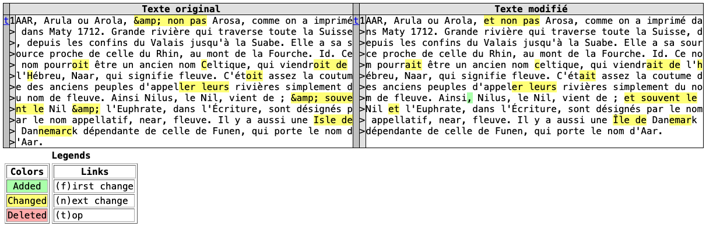
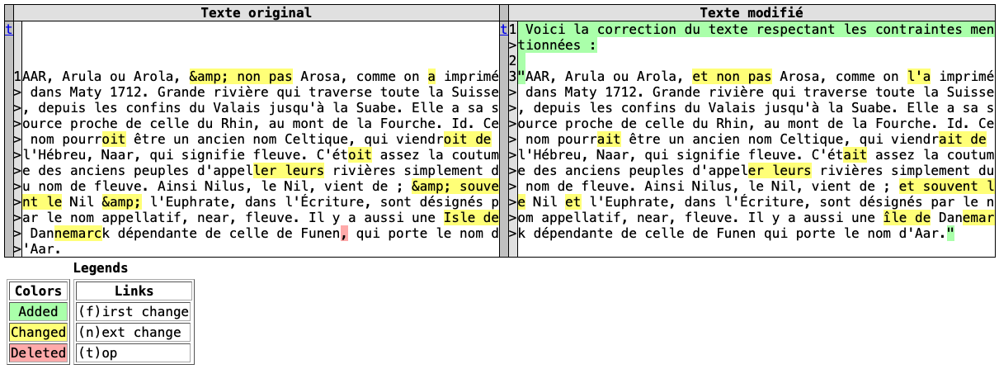
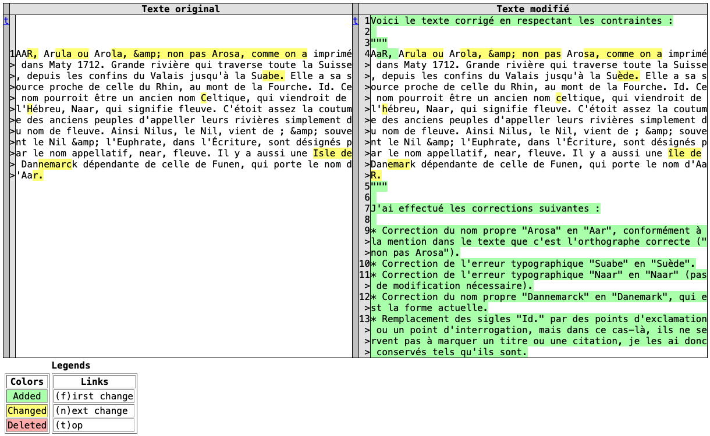
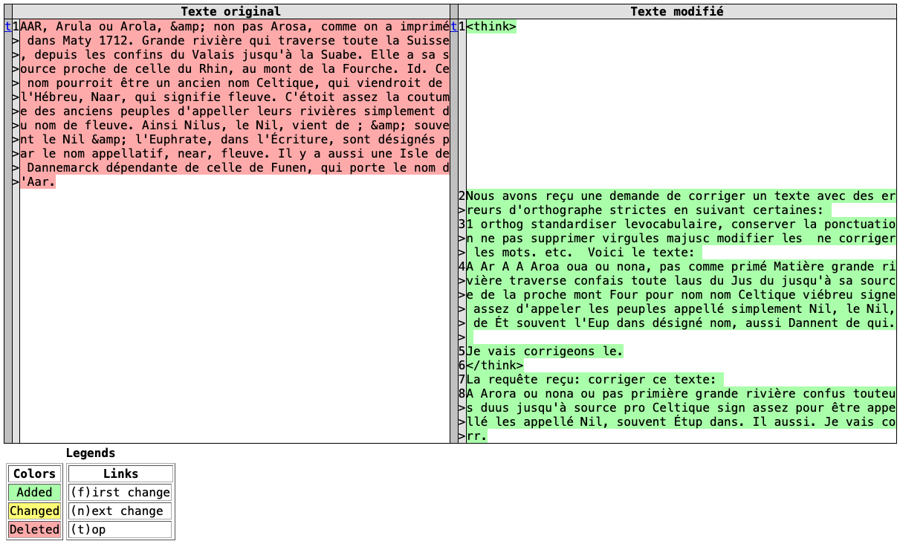

# Spelling Normalization with LLM: Experiments on Trevoux


These are experiments using large language models (LLMs) for spelling normalization on the Trevoux corpus. The goal is to modernize the spelling of historical French texts while preserving their original vocabulary and punctuation.

The experiments utilize the Ollama platform (https://ollama.com) to run various LLMs including Gemma, DeepSeek, Llama, and Mistral.

## Setup

1. Install Ollama by following the instructions at https://ollama.com/docs/installation.
2. Download and install the desired LLMs using Ollama commands, for example:
   ```bash
   ollama pull gemma3:4b
   ollama pull deepseek-r1:8b
   ollama pull llama3.1:8b
   ollama pull mistral:7b
   ```
3. Ensure you have Python installed along with the `ollama` Python package. You can install it via pip:
   ```bash
   pip install ollama
   ```

## Usage

1. Open the `spelling-normalization-llm.ipynb` notebook in Jupyter.
2. Modify the `model_name` variable to select the desired LLM from the `model_names` list.
3. Run the notebook cells to perform spelling normalization on the Trevoux example.
4. Review the outputs and compare the results from different models.
5. Sample outputs are available in the [diff](./diff) folder.

## Examples

Here are some examples of input texts and their normalized outputs using different models:

### gemma3:4b


### mistral:7b


### llama3.1:8b


### deepseek-r1:8b



